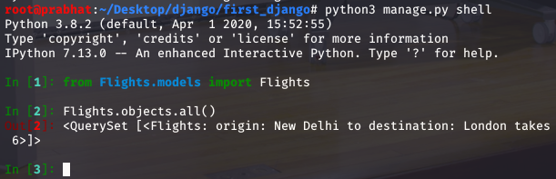

# Django

1. django-admin startproject <projectName>
   - helps to create new project of django with folder name <projectName> like npm init

2. python3 manage.py startapp <appName>

3. python3 manage.py makemigrations
     - run this command whenever change into models
     - It looks the model of the app and automatc generate migration in order to change in databases.
     - It's just for models of database whenever adding the database you must have to run this command.
     - used to changes and create datatbase
     - also helps to create models of new data
     - This command adds migration folder in your app and inside of 0001_initial.py file contains the models of your Entity

4. python3 manage.py sqlmigrate <appName> 0001
    - this command show you the Sql command of database

5. python3 manage,py migrate
    - Operations to perform:
        Apply all migrations: Flights, admin, auth, contenttypes, sessions

6. python3 manage.py shell
    - work with shell .

